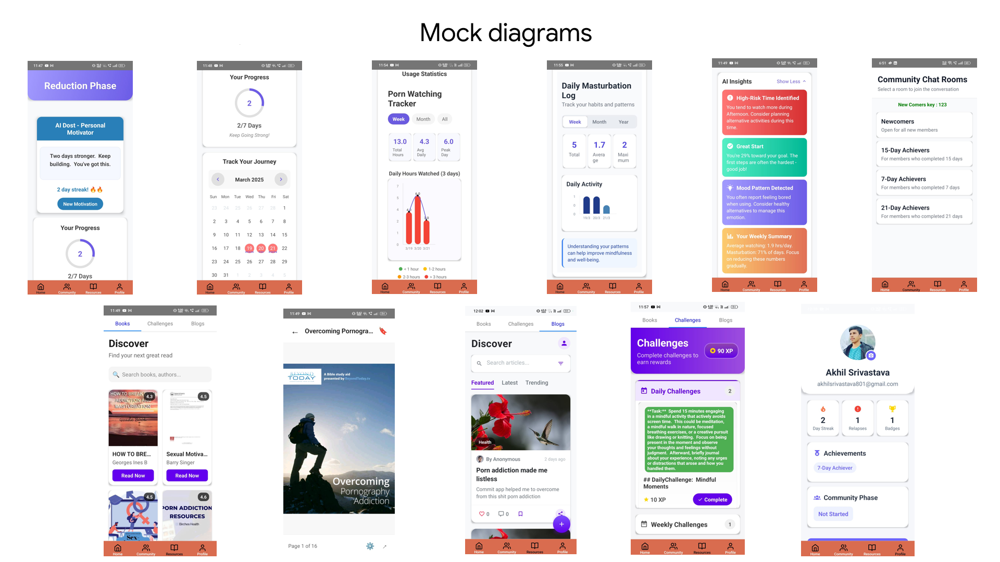

# Commit - AI-Powered Pornography Addiction Recovery App

Commit is a mobile application designed to help individuals overcome porn addiction through AI-driven insights, structured challenges, and community support. Built using React Native, Firebase, and Gemini AI, Commit empowers users with personalized guidance and a gamified recovery journey.

## Features
- **Two-Phase Recovery System**  
  - **Reduction Phase**: A 7/15/21-day self-logging journey where users record daily porn-watching hours, masturbation status, and mood to understand their habits and triggers.  
  - **Commitment Phase**: Streak-based challenge with accountability partner.
- **Personalized Recovery Journey**: AI-driven insights to track and reduce addiction patterns.
- **Gamified Challenges**: Daily, weekly, and monthly challenges tailored to user progress.
- **Community Support**: Join chat rooms and find accountability partners.
- **Progress Tracking**: Calendar-based activity logging and AI-generated reports.
- **Resource Hub**: Access books, blogs, and activities to aid recovery.
- **SOS & Meditation** : Mood-based calming audio & emergency contacts for instant support.

## Tech Stack
- **React Native**: Frontend framework for cross-platform mobile development.
- **Firebase**: Authentication, Firestore database, storage, and notifications.
- **Gemini AI**: AI-powered challenge generation and behavior analysis.



##[Watch the demo video]

(https://www.youtube.com/watch?v=BpsHVBQUMyk)

## Installation & Setup
### Prerequisites
- Node.js & npm/yarn
- Android Studio (for Android development)
- Xcode (for iOS development)
- Firebase Project Setup

### Steps
1. Clone the repository:
   ```sh
   git clone https://github.com/Akhilsri/COMMIT.git
   cd COMMIT
   ```
2. Install dependencies:
   ```sh
   npm install
   # OR
   yarn install
   ```
3. Set up Firebase:
   - Add `google-services.json` (Android) and `GoogleService-Info.plist` (iOS) to the respective directories.
4. Run the app:
   ```sh
   npm run android  # For Android
   npm run ios      # For iOS
   ```

## Contribution
1. Fork the repo and create a new branch.
2. Make changes and commit.
3. Submit a pull request.

